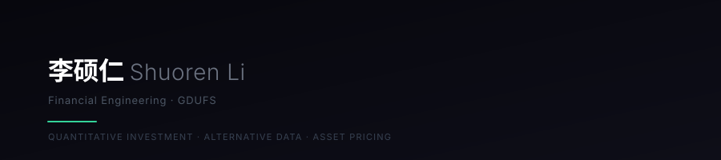

  

  

  
  
  
  

---

## 📊 GitHub Stats

  
  
  
   
  
   
  

---

## 🛠 Tech Stack

**Languages & Core**  

**ML & Data Science**  

**Tools & Platforms**  

---

## 📌 Featured Projects

| Direction | Canonical projects |
|---|---|
| **Quant Research & Trading** | **[QMT Investment Assistant](https://github.com/Leo984357/qmt_investment_assistant)** — HS300 多因子研究、LightGBM / Ridge、回测与 QMT 实盘 **[Hidden Pairs Factor](https://github.com/Leo984357/hidden-pairs-factor)** — 从基金隐形重仓关系挖掘股票因子 |
| **Mutual Fund Research** | **[Mutual Fund Research Skill](https://github.com/Leo984357/mutual-fund-research-skill)** — 从截图与持仓材料到联网核验、基金诊断、组合分析和动态换仓比较 **[Fund Pool Model](https://github.com/Leo984357/fund-pool-model)** — 公募基金横截面评分、日度选基与组合权重生成 |
| **Capital-Market Research Infrastructure** | **[A-Share Event Opportunity Engine](https://github.com/Leo984357/ashare-event-opportunity-engine)** — 将公告链接为资本事件，追踪状态与证据链 **[Strategy Audit Prototype](https://github.com/Leo984357/strategy-audit-prototype)** — 量化研究生命周期的可追溯审计原型 |

Archived predecessors and supporting utilities are intentionally omitted here; each direction points to
its current public implementation.

---

## 💼 Experience

| | |
|---|---|
| **Huatai Securities** · Institutional Business Intern | Guangzhou · Jul 2026 – Present |
| **Securities Times** · Research Intern | Shenzhen · Jul 2025 – Sep 2025 |
| **China Foreign Trade Centre** · VIP Affairs Intern | Guangzhou · Sep 2025 – Nov 2025 |
| **Tencent CSIG** · Operations Intern | Shenzhen · Jul 2024 – Aug 2024 |
| **GDUFS** · B.Eng Financial Engineering | Guangzhou · 2023 – 2027 |

---

## 📄 Research

**Corporate LLM Exposure Factor & Asset Pricing** 
~7.5M job postings (2014–2024) → NLP pipeline → firm-year AI exposure factor (Ef) → Chinese A-share asset pricing.

**HS300 LightGBM Multi-Factor Strategy** — *First Prize, FinTech Diankuan Cup (Top 2%)*  
81.87% cumulative return vs 11.87% benchmark (2022–2025). Live on QMT.
