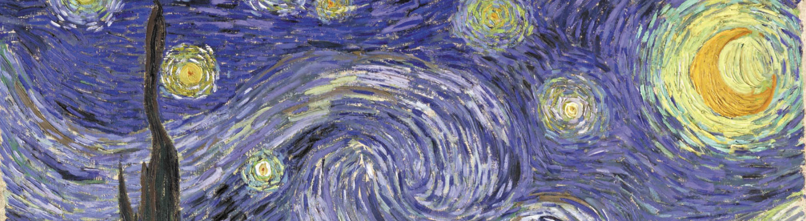

# Shuoren Li · 李硕仁

**金融研究，落到数据与工具。**

广东外语外贸大学金融工程在读。我围绕量化投资、另类数据与资产定价开展研究，把分散的金融信息整理成可追溯的数据、可检验的实验和可使用的工具。

[个人作品集](https://leo984357.github.io/) · [Email](mailto:leo2974656036@foxmail.com)

## 精选项目

### 01 / 上市公司委托理财分析框架

**从公开公告到结构化交易、机构关系与离线工作台。**

覆盖公告采集、规则抽取、产品生命周期、公司—机构关系和数据质量核验。公开版提供脱敏样例，可以本地启动工作台，查看公司画像、资金流向和原文证据。

[查看项目与界面预览 →](https://github.com/Leo984357/listed-company-wealth-framework)

### 02 / QMT Investment Assistant

**从多因子研究到模型训练、回测评估与模拟执行。**

以沪深 300 为研究场景，组织 LightGBM / Ridge 实验、组合构建、交易成本和阶段化评审。当前公开实现提供研究与模拟执行；方法、配置和研究记录在仓库内提供。

[查看研究流程与运行说明 →](https://github.com/Leo984357/qmt_investment_assistant)

### 03 / 公募基金投研 Skill

**把基金代码、持仓清单和截图，整理成有来源的投研报告。**

连接材料识别、公开数据核验、收益风险计算、组合暴露与换仓比较，提供安装步骤、示例提问，以及可复现的合成净值案例。

[查看使用示例与安装说明 →](https://github.com/Leo984357/mutual-fund-research-skill) · [完整示例报告](https://github.com/Leo984357/mutual-fund-research-skill/blob/main/examples/synthetic-diagnosis.md)

## 更多研究与工具

| 项目 | 关注的问题 | 可查看的内容 |
| --- | --- | --- |
| [A-Share Event Opportunity Engine](https://github.com/Leo984357/ashare-event-opportunity-engine) | 多份公告如何归入同一个资本事件？ | 事件关联、状态迁移、证据链与合成样例 |
| [Hidden Pairs Factor](https://github.com/Leo984357/hidden-pairs-factor) | 基金持仓覆盖能否形成股票研究信号？ | 因子构建、负结果、时间切分诊断与数据边界 |
| [Fund Pool Model](https://github.com/Leo984357/fund-pool-model) | 如何形成可重复的日度基金池？ | 净值入库、横截面评分与组合权重 |
| [Strategy Audit](https://github.com/Leo984357/strategy-audit-prototype) | 如何记录策略研究与审核过程？ | Solidity / Hardhat 存证与角色权限原型 |
| [Remote Workflow](https://github.com/Leo984357/remote-workflow-framework) | 如何连接日常终端与远程计算？ | 多机任务路由、运行手册与可恢复备份 |

## 研究方向

**生成式 AI 暴露与资产定价**：从企业招聘文本构建公司层面的 AI 暴露指标，研究其与 A 股资产定价的关系。

**量化研究的可复核性**：关注数据时点、实验配置、交易成本、样本外评估与结果留痕，让每个结论对应明确的研究条件。

## 经历与教育

| 时间 | 经历 |
| --- | --- |
| 2026.07–至今 | 华泰证券 · 机构业务实习 |
| 2025.09–2025.11 | 中国对外贸易中心 · 贵宾事务实习 |
| 2025.07–2025.09 | 证券时报 · 研究实习 |
| 2024.07–2024.08 | 腾讯 CSIG · 运营实习 |
| 2023–2027 | 广东外语外贸大学 · 金融工程（在读） |

## 常用工具

**研究与数据** · Python / pandas / SQL / LightGBM / scikit-learn 
**工程与交付** · Git / SQLite / Streamlit / PySide6 / LaTeX

Banner：Vincent van Gogh, The Starry Night (1889)，星空局部。[原作与来源](https://commons.wikimedia.org/wiki/File:VanGogh-starry_night.jpg) · Public domain.
