<picture>
  <source media="(prefers-reduced-motion: reduce)" srcset="assets/starry-night-ascii.svg">
  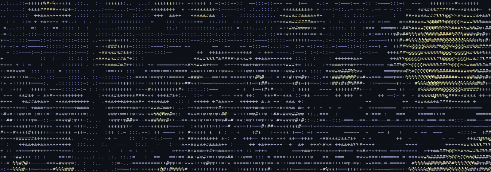
</picture>

<picture>
  <source media="(max-width: 600px)" srcset="assets/profile-hero-mobile.svg">
  
</picture>

  <a href="https://leo984357.github.io/"><picture><source media="(max-width: 600px)" srcset="assets/nav-portfolio-mobile.svg">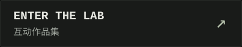</picture></a>
  <a href="mailto:leo2974656036@foxmail.com"><picture><source media="(max-width: 600px)" srcset="assets/nav-email-mobile.svg">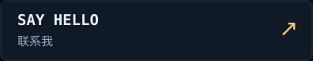</picture></a>
  <a href="https://github.com/Leo984357?tab=repositories"><picture><source media="(max-width: 600px)" srcset="assets/nav-source-mobile.svg">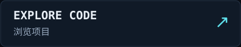</picture></a>

<picture><source media="(max-width: 600px)" srcset="assets/section-work-mobile.svg">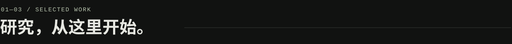</picture>

<a href="https://github.com/Leo984357/listed-company-wealth-framework">
<picture>
  <source media="(max-width: 600px)" srcset="assets/project-wealth-mobile.svg">
  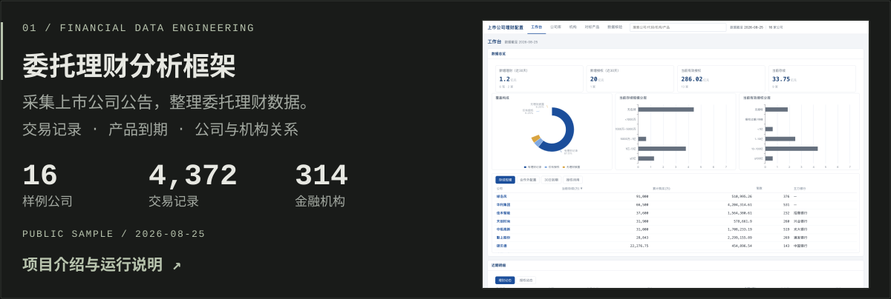
</picture>
</a>

<a href="https://github.com/Leo984357/qmt_investment_assistant">
<picture>
  <source media="(max-width: 600px)" srcset="assets/project-qmt-mobile.svg">
  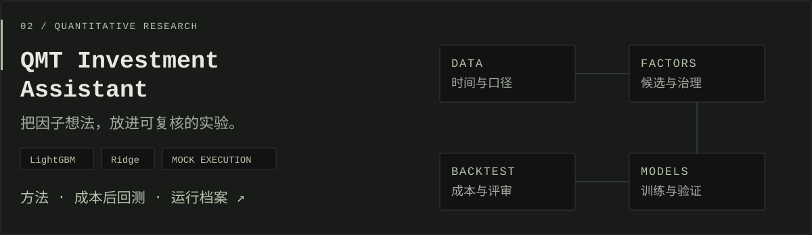
</picture>
</a>

<a href="https://github.com/Leo984357/mutual-fund-research-skill">
<picture>
  <source media="(max-width: 600px)" srcset="assets/project-fund-mobile.svg">
  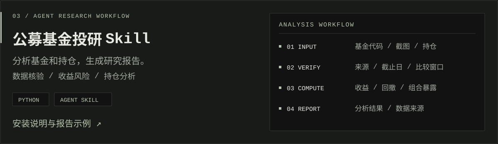
</picture>
</a>

<picture><source media="(max-width: 600px)" srcset="assets/section-index-mobile.svg">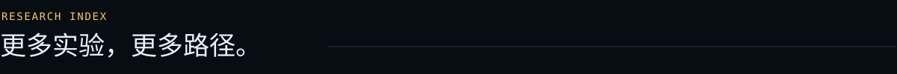</picture>

<a href="https://github.com/Leo984357/ashare-event-opportunity-engine">
<picture>
  <source media="(max-width: 600px)" srcset="assets/index-event-mobile.svg">
  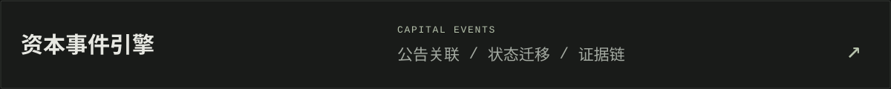
</picture>
</a>

<a href="https://github.com/Leo984357/hidden-pairs-factor">
<picture>
  <source media="(max-width: 600px)" srcset="assets/index-hidden-mobile.svg">
  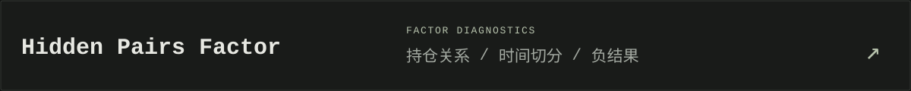
</picture>
</a>

<a href="https://github.com/Leo984357/fund-pool-model">
<picture>
  <source media="(max-width: 600px)" srcset="assets/index-pool-mobile.svg">
  
</picture>
</a>

<a href="https://github.com/Leo984357/strategy-audit-prototype">
<picture>
  <source media="(max-width: 600px)" srcset="assets/index-audit-mobile.svg">
  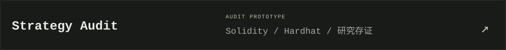
</picture>
</a>

<a href="https://github.com/Leo984357/remote-workflow-framework">
<picture>
  <source media="(max-width: 600px)" srcset="assets/index-remote-mobile.svg">
  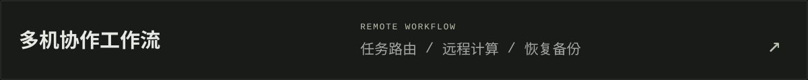
</picture>
</a>

<a href="https://leo984357.github.io/#about">
<picture>
  <source media="(max-width: 600px)" srcset="assets/index-about-mobile.svg">
  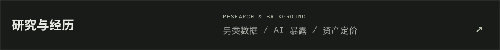
</picture>
</a>

<picture>
  <source media="(max-width: 600px)" srcset="assets/profile-tools-mobile.svg">
  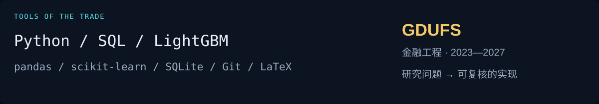
</picture>

文字索引 / Accessible project index

**Shuoren Li · 李硕仁**，广东外语外贸大学金融工程在读。关注量化投资、另类数据与资产定价，把研究问题转化为可复核的实验与工具。

- [上市公司委托理财分析框架](https://github.com/Leo984357/listed-company-wealth-framework)：公告采集、交易抽取、机构关系和离线工作台。
- [QMT Investment Assistant](https://github.com/Leo984357/qmt_investment_assistant)：因子研究、成本后回测与模拟执行。
- [公募基金投研 Skill](https://github.com/Leo984357/mutual-fund-research-skill)：证据核验、风险计算与研究报告；[完整合成案例](https://github.com/Leo984357/mutual-fund-research-skill/blob/main/examples/synthetic-diagnosis.md)。
- [资本事件引擎](https://github.com/Leo984357/ashare-event-opportunity-engine) · [Hidden Pairs Factor](https://github.com/Leo984357/hidden-pairs-factor) · [Fund Pool Model](https://github.com/Leo984357/fund-pool-model)
- [Strategy Audit](https://github.com/Leo984357/strategy-audit-prototype) · [Remote Workflow](https://github.com/Leo984357/remote-workflow-framework)
- 研究方向：招聘文本中的生成式 AI 暴露、资产定价与量化实验的可复核性。
- 经历：华泰证券（2026.07–至今）、中国对外贸易中心（2025.09–11）、证券时报（2025.07–09）、腾讯 CSIG（2024.07–08）。[详情](https://leo984357.github.io/#about)

ASCII art after Vincent van Gogh’s <i>The Starry Night</i> (1889). [静态版](assets/starry-night-ascii.svg) · [画作来源与生成方式](assets/ARTWORK.md) · [SVG 源码](scripts/build_profile_visuals.py)
